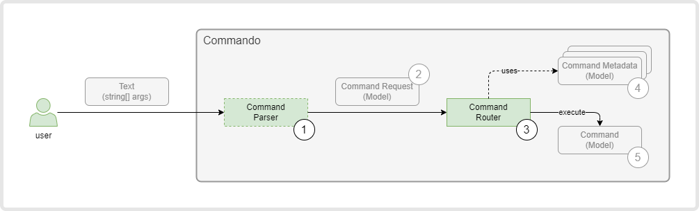

# Console Forge

Console forge is a framework developed with the purpose of easily creating and describing commands (with complex arguments) in a console application.

## Internal Structure

Console Forge has the following internal components:

1) Command Parser
2) Internal Command Model
3) Command Router
4) Command Model



### 1) Command Parser

The purpose of a Command Parser is to understand the syntax used by the user, parse the provided text and extract a number of important values which are then stored in some internal objects which we will call, from now on, Internal Command Model.

### 2) Internal Command Model

The Internal Command Model contains the following important properties:

- **verb**
  - optional
- **options**
  - a list of name-value pairs.
    - name
      - a string.
      - If an option instance is created, it has a not-empty name.
    - value
      - An option may have or may not have a value.
      - a string - At this level, the value is always a string. It will be parsed later, to the appropriate type, when the mapping to an actual command instance is performed by the Command Router.
  - the list may be empty - a command may have no options.
- **operands**
  - a string - These are values without names.
  - an index of the operand, as it is appear in the command text, is also provided.

### 3) Command Router

This component is responsible for identifying the appropriate Command object to be executed. This is done based on the values from the Internal Command Model.

The role of this component may be easier to understand after we explain the Command Model.

### 4) Command Model

#### A Parallel to other UI frameworks

It may be easier to understand the Command objects by making a parallel to other UI frameworks. So, let's do just that.

A Command objects is the equivalent of:

- a Page from ASP.NET Razor Pages;
- a View Model from the MVVM pattern used in WPF.

### The Command

Here it is an example of a Command:

```c#
[Command("dummy", ShortDescription = "A dummy command that shows how to use Commando.")]
public class DummyCommand : ICommand
{
    [CommandParameter(Name = "text", ShortName = 't', IsOptional = false)]
    public string DummyText { get; set; }

    public Task Execute()
    {
        DummyText += " - text was updated";

        return Task.CompletedTask;
    }
}
```

A Command must implement the `ICommand` interface.

The `Command` attribute is optional and may provide additional information and constraints about the command:

- Command Name
  - Case insensitive.
  - If provided, the command will be executed only if the verb from the internal model matches this value.
- Short Description
  - This value is displayed by the help command.

More details about the command can be found here:

- TBD