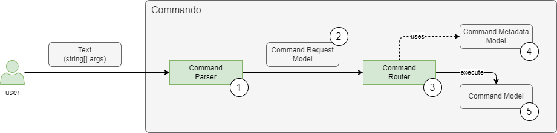

# Commando - Internal Structure

Commando is a framework developed with the purpose of easily parsing and executing commands in a console application.

## Execution Steps

For processing a text command, the following steps are performed:

- Parse the text command.
- Instantiate the correct `ICommand` class.
  - Populate all the parameters of the `ICommand` instance with values from the text command.

- Execute the `ICommand`.

## Internal Structure

To handle the request as stated previously, the following internal components and models are created:

1) Command Parser
2) Command Request Model
3) Command Router
4) Command Metadata Model
5) Command Model



### 1) Command Parser

The purpose of a Command Parser is to understand the syntax used by the user, parse the provided text and extract all important values, which are then stored in the Command Request Model objects.

#### Data

- the command text (arguments) provided by the user in the console.
- it is obtained from .NET as an array of strings: `private static Main(string[] args)`

#### Execution

- Uses a `ICommandParser` implementation to transform the arguments into a `CommandRequest` object (part of the Command Request Model).

### 2) Command Request Model

The Command Request Model contains the following important properties:

- **verb**
  - optional
- **options**
  - a list of name-value pairs.
    - name
      - string
      - not-empty.
    - value
      - string - At this level, the value is always a string. It will be parsed later, to the appropriate type, when the mapping to an actual command instance is performed by the Command Router.
      - may be empty.
  - optional - The list of options may be empty. A command may have no options.
- **operands**
  - list of strings
    - These are values without names.
  - an index of the operand, as it appears in the text command, is also provided.

### 3) Command Router

It is responsible for instantiating and executing the appropriate `ICommand` object.

#### Data

For its job, the router needs two types of data:

- **available commands**
  - also known as Command Metadata Model.
  - a list with information about all the classes that represent a command.
  - obtained using reflection from the assembly provided at setup time.
- **command request**
  - Also known as Command Request Model.
  - Contains all the data from the user's command line request.


#### Execution

What the Command Router remains to do is:

1. **identify command** - Search in the list of available commands for the one specified by the Command Request Model.
2. **instantiate command**
   - **populate command parameters** -  This is done based on the metadata with values from the text command.

3. **execute command**

### 4) Command Metadata Model

- A list of `CommandMetadata` objects containing all the necessary information about all the available commands.
- Created at setup time using Reflection, from the provided Assemblies.
  - It is suggested to place the `ICommand` classes in a separate assembly that containing the presentation layer.
- Contains commands provided by the Commando library itself, like the `help` command, but also custom commands, created by the consumer of the library.

These metadata are used by the Command Router to instantiate the appropriate command class and populate correctly its properties.

### 5) Command Model

#### A Parallel to other UI frameworks

A Command class is the equivalent of:

- a Page class from ASP.NET Razor Pages;
- a View Model class from the MVVM pattern used in WPF.

#### The Command

Here it is an example of a Command:

```c#
[Command("dummy", ShortDescription = "A dummy command that shows how to use Commando.")]
public class DummyCommand : ICommand
{
    [CommandParameter(Name = "text", ShortName = 't', IsOptional = true)]
    public string DummyText { get; set; }

    public Task Execute()
    {
        DummyText += " - additional text";

        return Task.CompletedTask;
    }
}
```

A Command must implement the `ICommand` interface.

The `Command` attribute is optional and may provide additional information and constraints about the command:

- Command Name
  - Case insensitive.
  - If provided, the command will be executed only if the verb from the generic model matches this value.
- Short Description
  - This value is displayed by the help command.

More details about the command can be found here:

- TBD